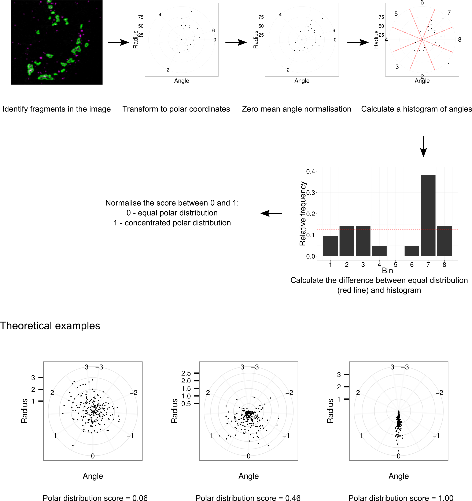

My research work is focused on image analysis in biological and medical imaging. Here are short descriptions of my projects.

# Angular distribution score #
Angular distribution score is used to quantify punctate structures in polar system. Particularly we used them to quantify the distribution of endoplasmic reticulum exit sites and the distribution of Golgi fragments around the nucleus. More details are explained in [my paper on YIPF proteins](https://dx.doi.org/10.1007/s00418-016-1527-3).

# Unsupervised discrimination between protein subcellular localisation phenotypes #
Subcellular localisation of proteins can be determined by expressing fluorescently-tagged proteins in cells or staining endogenous proteins with fluorescently-labelled antibodies. The cells can then be imaged by microscope and we can interpret the localisation by looking at the image. 

As a part of my PhD thesis I developed an algorithm for unsupervised segregation of cells. First I extracted texture features and then used gaussian mixed models to cluster the images into three classes. More details to follow.

# Anomaly detection algorithm to find nuclei with altered morphology #

# Prediction of bone fracture risk from DXA images #